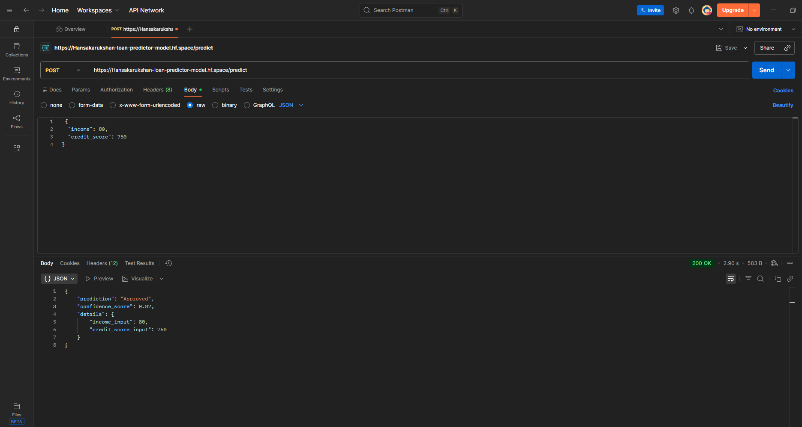

# Loan Approval Prediction System (Deep Learning)

## 📌 Project Overview
This project is a **Deep Learning–based Loan Approval Prediction System** developed as part of a university assignment.
The system trains a neural network model on a real-world credit dataset, exposes it through a **FastAPI backend**, containerizes the application using **Docker**, and deploys it on **Hugging Face Spaces**.

The API predicts whether a loan application will be **Approved** or **Rejected** based on:
- Applicant income
- Credit score

---

## 🧠 Model Details
- **Model Type:** Deep Neural Network (Multi-Layer Perceptron)
- **Framework:** TensorFlow (via SciKeras)
- **Architecture Highlights:**
  - Dense layers with ReLU activation
  - Batch Normalization
  - Dropout for regularization
  - Adam optimizer
- **Output:** Binary classification (Approved / Rejected)

The model is trained offline and serialized as `loan_model.pkl` for production inference.

---

## ⚙️ System Architecture
The system follows a production-ready ML deployment pipeline:

1. Dataset downloaded from the internet
2. Feature engineering to match API input schema
3. Deep Learning model training
4. Model serialization using `joblib`
5. FastAPI backend for inference
6. Dockerized application
7. Deployed on Hugging Face Spaces

---

## 🚀 Deployed API Endpoint
The project is deployed and publicly accessible at:

**Prediction Endpoint:**
[https://hansakarukshan-loan-predictor-model.hf.space/predict](https://hansakarukshan-loan-predictor-model.hf.space/predict)

Postman Screenshots of testing endpoint:

